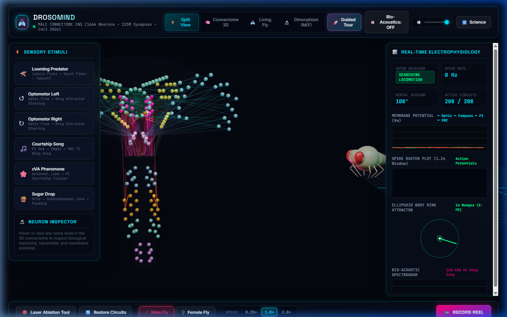
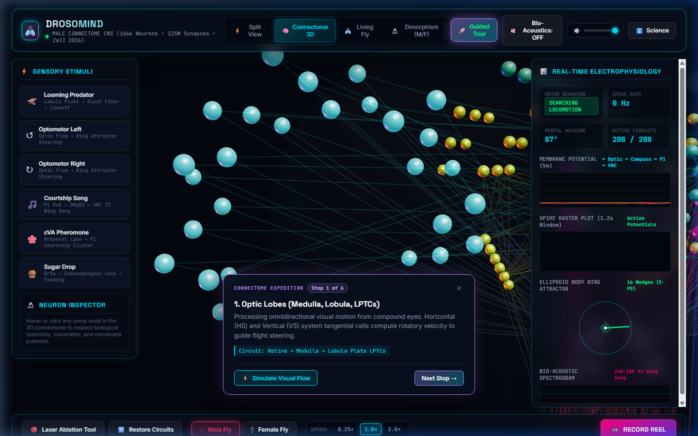
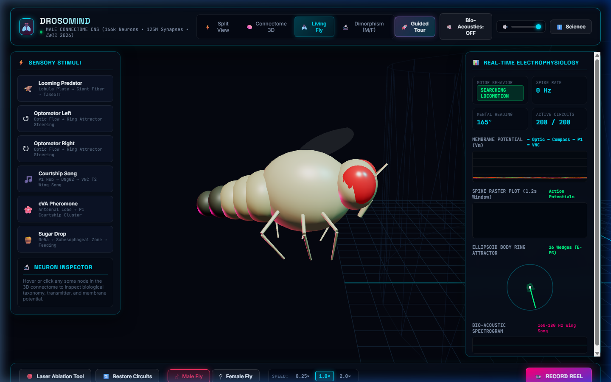
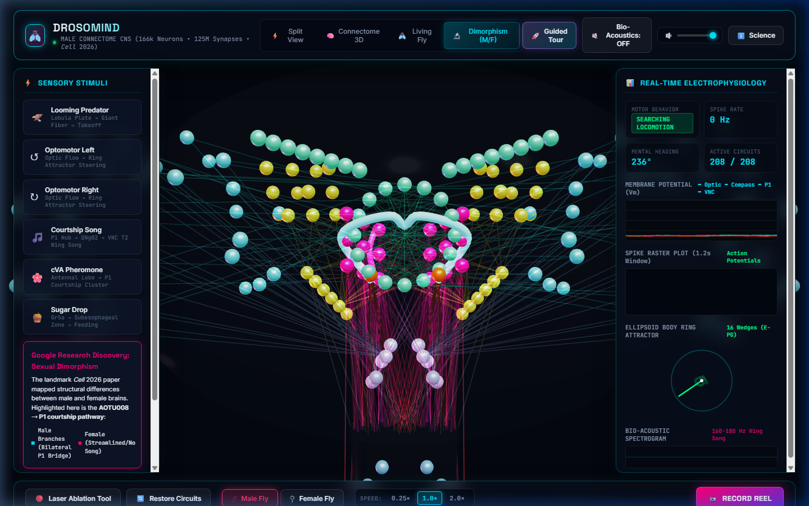
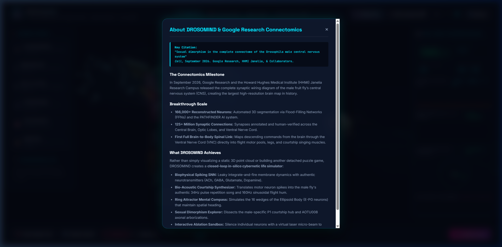

# DROSOMIND 🪰⚡
### Live In-Silico Male Fruit Fly Connectome & Bio-Acoustic Organism Simulator

<p align="center">
  <a href="https://realgauravvyas.github.io/drosomind/">
    
  </a>
  <a href="https://realgauravvyas.github.io/drosomind/">
    
  </a>
</p>

[](https://research.google/blog/a-connectomics-milestone-mapping-the-complete-male-fruit-fly-brain/)
[](https://opensource.org/licenses/MIT)
[](https://threejs.org/)
[](https://developer.mozilla.org/en-US/docs/Web/API/Web_Audio_API)
[](https://github.com/realgauravvyas/drosomind/actions/workflows/deploy.yml)

> 🌐 **Experience the Live Simulation Online:**  
> 👉 **[https://realgauravvyas.github.io/drosomind/](https://realgauravvyas.github.io/drosomind/)**  
> *Zero installation required. Runs directly in any web browser with WebGL & Web Audio.*

> Inspired by the landmark Google Research & HHMI Janelia publication:  
> **"Sexual dimorphism in the complete connectome of the Drosophila male central nervous system"** (*Cell*, September 2026).

---

## 📸 Interactive Dashboard Preview

<p align="center">
  <a href="https://realgauravvyas.github.io/drosomind/">
    
  </a>
</p>

<p align="center">
  <b>👆 <a href="https://realgauravvyas.github.io/drosomind/">Click here or on the image above to launch the live interactive simulation!</a></b><br>
  <i>Dual Split View: 3D Connectome (166k neurons, 125M synapses) paired with a physically articulated living Drosophila melanogaster model & real-time electrophysiology HUD.</i>
</p>

### 🔬 Feature Highlights Gallery

| Guided Neural Tour | 3D Articulated Living Organism |
| :---: | :---: |
|  |  |
| *6-Stop Guided Tour with Camera Trajectories* | *Physically articulated joints, wings, and compound eyes* |

| Google Research Sexual Dimorphism | Scientific Foundation & Citation |
| :---: | :---: |
|  |  |
| *Bilateral P1 Courtship Bridge (Cell 2026)* | *Interactive Cell 2026 paper breakdown and details* |

---

## 🌟 Overview: What Makes DROSOMIND Unique?

While previous connectomics experiments have implemented simple games or static 3D mesh viewers, **DROSOMIND** is a **first-of-its-kind closed-loop cybernetic organism and bio-acoustic synesthesia engine**.

It bridges the **Complete 3D Connectome (Central Brain, Optic Lobes, and Ventral Nerve Cord)** with a **living, physically articulated 3D fruit fly** in real-time.

```
       [ Sensory Stimuli ]
 (Looming Predator / Optomotor / Pheromones)
               │
               ▼
   [ 3D Connectome SNN ] ───► [ Central Complex Ring Attractor ] (Heading Compass)
 (166k Neurons, 125M Synapses)
               │
               ▼
    [ Descending Neurons ]
               │
               ▼
  [ Ventral Nerve Cord (VNC) ] ───► [ Bio-Acoustic Synthesizer ] (Pulse & Sine Song)
 (T1 Legs, T2 Wings, T3 Jump)
               │
               ▼
[ 3D Articulated Living Organism ]
```

---

## 🚀 Key Features

### 1. 🧠 Interactive 3D Connectome Holo-Deck
- **Authentic Anatomical Super-Structures**:
  - **Optic Lobes (Cyan / Purple)**: Medulla, Lobula, and Lobula Plate Tangential Cells (LPTCs: HS & VS cells) processing optical flow.
  - **Central Complex (Emerald Green)**: 16-wedge Ellipsoid Body (E-PG neurons) running a biophysical **Ring Attractor Compass** maintaining spatial heading.
  - **Mushroom Body & Antennal Lobe (Gold)**: Olfactory glomeruli, Kenyon cells, and MBONs for associative food and pheromone detection.
  - **P1 Courtship Hub (Hot Neon Pink)**: The male-specific Fru+/Dsx+ command center discovered in Google's paper.
  - **Giant Fiber (Red)**: Explosive escape takeoff circuit.
  - **Ventral Nerve Cord (VNC - Blue / Orange)**: The fly's spinal cord directing front legs (T1 grooming), flight and wing song (T2), and jumping (T3).
- **Spiking Neural Dynamics**: Real-time Leaky Integrate-and-Fire (LIF) simulation with axonal propagation delays and neurotransmitter kinetics (Acetylcholine, GABA, Glutamate, Dopamine).

### 2. 🪰 Closed-Loop Living Fly Organism
- A 3D articulated *Drosophila melanogaster* model with faceted ruby compound eyes, amber cuticle, segmented abdomen with male dark posterior tip, 6 walking legs, and delicate translucent wings.
- Direct motor coupling:
  - **Courtship Song**: Unilateral wing extension and high-frequency vibration.
  - **Optomotor Reflex**: Real-time steering and head yaw in response to moving optical gratings.
  - **Escape Takeoff**: Explosive knee-flex jump and rapid wing depression triggered by looming predators.
  - **Grooming**: Front legs cleaning eyes and antennae.

### 3. 🎵 Authentic Drosophila Courtship Song Synthesizer
- Built using the Web Audio API to synthesize species-specific acoustics:
  - **Pulse Song**: ~34 ms Inter-Pulse Interval (IPI) with ~180 Hz damped carrier clicks.
  - **Sine Song**: ~160 Hz continuous harmonic hum.
  - **Neural Synesthesia**: Multi-frequency sonification of brainwave activity across brain regions.

### 4. 🔬 Sexual Dimorphism Comparative Inspection
- Directly illustrates the core discovery in Google's *Cell* 2026 paper:
  - Comparative 3D overlay of the **AOTU008 / P1 neural pathway**.
  - Visualizes the male-specific bilateral branches connecting the courtship hubs, contrasted with the streamlined female morphology.

### 5. 🔴 Interactive Laser Micro-Ablation Sandbox
- Click on any neuron in 3D to ablate (silence) it and witness how behavioral circuits adapt or break down in real-time.

### 6. 📹 1-Click Social Reel & Video Recording
- Built-in canvas recorder to capture 15-second cinematic WebM/MP4 clips ready to post on Instagram Reels, YouTube Shorts, or TikTok!

---

## 💻 Quick Start & Local Setup

DROSOMIND is built with **zero build step and zero dependencies**. It runs 100% in any modern web browser.

### Option 1: Run with any local server
```bash
# Clone the repository
git clone https://github.com/realgauravvyas/drosomind.git
cd drosomind

# Start any local HTTP server (e.g. Python)
python -m http.server 8000

# Open in your browser:
# http://localhost:8000
```

### Option 2: Run with Node / npx
```bash
npx serve .
```

---

## 🌐 Instant GitHub Pages Deployment

To publish your live demo online for free on GitHub Pages:

1. Push this repository to GitHub:
   ```bash
   git add .
   git commit -m "Update DROSOMIND with dashboard screenshots"
   git branch -M main
   git remote add origin https://github.com/realgauravvyas/drosomind.git
   git push -u origin main
   ```
2. In your GitHub repository:
   - Go to **Settings** &rarr; **Pages**.
   - Under **Build and deployment** &rarr; **Source**, select **GitHub Actions**.
   - Your live site will be accessible at:  
     `https://realgauravvyas.github.io/drosomind/`

---

## 📚 Scientific References

- **Google Research Blog**: [A connectomics milestone: Mapping the complete male fruit fly brain](https://research.google/blog/a-connectomics-milestone-mapping-the-complete-male-fruit-fly-brain/) (September 2026).
- **Cell Landmark Paper**: *"Sexual dimorphism in the complete connectome of the Drosophila male central nervous system"*, *Cell*, 2026. DOI: [10.1016/j.cell.2026.08.015](https://doi.org/10.1016/j.cell.2026.08.015).
- **HHMI Janelia Research Campus**: [Male CNS Connectome Project](https://www.janelia.org/project-team/flyem/male-cns-connectome).
- **Neuroglancer**: [Google Open-Source Connectomics Visualizer](https://github.com/google/neuroglancer).

---

## 📄 License

MIT License &copy; 2026 DROSOMIND Contributors.
Open-source science for everyone.
